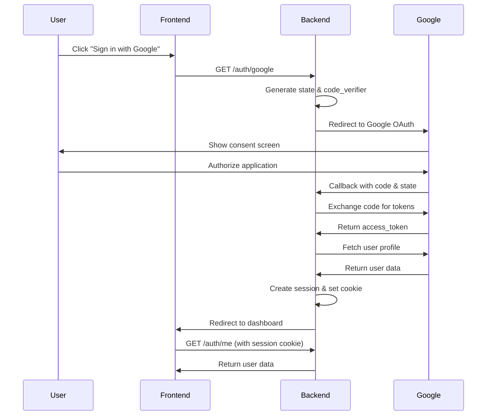

# Development Guide - Astral Nexus API

## Quick Reference

### Server Information

- **Development URL**: `http://localhost:3001`
- **Swagger Documentation**: `http://localhost:3001/swagger`
- **OAuth Endpoints**: `http://localhost:3001/auth/oauth`

### **REST API Endpoints**

| Method | Endpoint                         | Description            | Tag   |
| ------ | -------------------------------- | ---------------------- | ----- |
| GET    | `/`                              | API welcome message    | App   |
| GET    | `/health`                        | Health check           | App   |
| GET    | `/version`                       | Version info           | App   |
| GET    | `/auth/oauth/:provider`          | OAuth login            | Auth  |
| GET    | `/auth/oauth/:provider/callback` | OAuth callback         | Auth  |
| POST   | `/auth/logout`                   | User logout            | Auth  |
| GET    | `/users/profile/:id`             | Get user profile       | Users |
| PUT    | `/users/profile/:id`             | Update user profile    | Users |
| GET    | `/users`                         | List users (paginated) | Users |

### **OAuth2 Integration**

**Supported Providers:**

- Google OAuth2
- GitHub OAuth2
- Discord OAuth2
- Twitter OAuth2
- Facebook OAuth2

**OAuth Flow:**

1. User visits `/auth/oauth/google` (or other provider)
2. Redirects to provider's authorization page
3. User authorizes application
4. Provider redirects to `/auth/oauth/google/callback`
5. Backend exchanges code for access token
6. User profile is fetched and user is authenticated

## How to Use This Setup

### 1. **OAuth Configuration**

#### Environment Variables

Add OAuth credentials to your `.env` file:

````env
# GitHub OAuth
GITHUB_CLIENT_ID=your_github_client_id
GITHUB_CLIENT_SECRET=your_github_client_secret

# Discord OAuth
DISCORD_CLIENT_ID=your_discord_client_id
DISCORD_CLIENT_SECRET=your_discord_client_secret

# OAuth Redirect URL
OAUTH_REDIRECT_URL=http://localhost:3001/auth/oauth

#### Provider Setup (Where to get your CLIENT_ID and SECRET )
For Google OAuth Setup:

Go to Google Cloud Console
Create a new project or select existing
Enable Google+ API
Create OAuth 2.0 credentials
Set redirect URI: http://localhost:3001/auth/oauth/google/callback

### 2. **Testing the API**

#### Using Swagger UI

1. Open `http://localhost:3001/swagger`
2. Navigate through the organized tags (App, Auth, Users)
3. Test endpoints directly in the browser

#### Using curl

```bash
# Health check
curl http://localhost:3001/health

# Login
curl -X POST http://localhost:3001/auth/login \
  -H "Content-Type: application/json" \
  -d '{"username":"admin","password":"password"}'

# Get user profile
curl http://localhost:3001/users/profile/1
````

### 3. **Adding New Features**

#### Adding a New REST Endpoint

1. Open the appropriate route file (e.g., `src/routes/users.ts`)
2. Add your endpoint with proper typing:

```typescript
.post('/new-endpoint', ({ body }) => {
  // Your logic here
  return { success: true };
}, {
  body: t.Object({
    // Define your input schema
  }),
  detail: {
    tags: ['Users'],
    summary: 'Your endpoint description'
  }
})
```

### 4. **Configuration**

#### Environment Variables

Create `.env` file:

```env
PORT=3001
NODE_ENV=development
CORS_ORIGIN=*
# Google OAuth
GOOGLE_CLIENT_ID=your_google_client_id
GOOGLE_CLIENT_SECRET=your_google_client_secret
```

#### App Configuration

Modify `src/config/app.ts` for:

- Server settings
- API paths
- CORS policies

## 🔧 Development Workflow

### 1. **Setup OAuth2.0 Environment**

Before starting development, create a `.env` file in the backend directory:

```bash
cd astralnexus_be
cp .env.example .env
```

Update the `.env` file with your Google OAuth2.0 credentials:

```env
# Server Configuration
PORT=3001
NODE_ENV=development

# CORS Configuration
CORS_ORIGIN=http://localhost:5173,http://localhost:5174,http://localhost:5175

# Google OAuth2.0 (Required)
GOOGLE_CLIENT_ID=your_google_client_id_here
GOOGLE_CLIENT_SECRET=your_google_client_secret_here

# OAuth2.0 Redirect URIs
OAUTH_REDIRECT_URI=http://localhost:3001/auth/google/callback
FRONTEND_SUCCESS_REDIRECT=http://localhost:5173/dashboard
FRONTEND_ERROR_REDIRECT=http://localhost:5173/login?error=oauth_failed

# Session/JWT Configuration
JWT_SECRET=your_super_secure_jwt_secret_here
SESSION_SECRET=your_session_secret_here
```

### 2. **Get Google OAuth2.0 Credentials**

1. Go to [Google Cloud Console](https://console.cloud.google.com/)
2. Create a new project or select an existing one
3. Enable the **Google+ API** or **Google Identity API**
4. Go to **Credentials** → **Create Credentials** → **OAuth 2.0 Client IDs**
5. Set **Application type** to **Web application**
6. Add **Authorized redirect URIs**:
   - `http://localhost:3001/auth/google/callback`
   - `http://localhost:3001/auth/google/callback` (for production, use your domain)
7. Copy the **Client ID** and **Client Secret** to your `.env` file

### 3. **Start Development Servers**

```bash
# Start Backend (Terminal 1)
cd astralnexus_be
pnpm dev

# Start Frontend (Terminal 2)
cd astralnexus_ui
pnpm dev
```

### 4. **Test OAuth2.0 Flow**

1. Open `http://localhost:5173/login`
2. Click **"Sign in with Google"**
3. Complete Google OAuth flow
4. Should redirect to `http://localhost:5173/dashboard`
5. User info should be displayed on dashboard

### 5. **Development URLs**

- **Frontend (Root)**: `http://localhost:5173`
- **Backend API**: `http://localhost:3001`
- **Swagger Docs**: `http://localhost:3001/swagger`
- **OAuth Login**: `http://localhost:3001/auth/google`
- **Dashboard**: `http://localhost:5173/dashboard`

## 🔐 OAuth2.0 Integration Deep Dive

### **Implementation Details**

The OAuth2.0 implementation uses:

- **elysia-oauth2**: OAuth2.0 plugin for Elysia
- **Arctic**: Multi-provider OAuth2.0 client library
- **Session Management**: Cookie-based sessions with secure configuration

### **OAuth2.0 Flow Explanation**



### **Security Features**

1. **PKCE (Proof Key for Code Exchange)**

   - Uses `code_verifier` and `code_challenge`
   - Prevents authorization code interception attacks

2. **State Parameter**

   - Prevents CSRF attacks
   - Validates OAuth callback authenticity

3. **Secure Cookies**

   - `HttpOnly`: Prevents XSS access to session cookies
   - `Secure`: HTTPS only in production
   - `SameSite`: CSRF protection

4. **Session Management**
   - Server-side session storage
   - Automatic session cleanup
   - Configurable session expiration

### **API Endpoints Reference**

| Endpoint                | Method | Description            | Authentication |
| ----------------------- | ------ | ---------------------- | -------------- |
| `/auth/<provider>`          | GET    | Initiate Google OAuth  | None           |
| `/auth/<provider>/callback` | GET    | OAuth callback handler | None           |
| `/auth/me`              | GET    | Get current user       | Session Cookie |
| `/auth/logout`          | POST   | Logout user            | Session Cookie |

### **Frontend Integration**

```typescript
// Redirect to OAuth login
const handleGoogleSignIn = () => {
  window.location.href = "http://localhost:3001/auth/<provider>";
};

// Check authentication status
const checkAuth = async () => {
  const response = await fetch("http://localhost:3001/auth/me", {
    credentials: "include", // Important for cookies
  });

  if (response.ok) {
    const data = await response.json();
    return data.user;
  }
  return null;
};

// Logout
const logout = async () => {
  await fetch("http://localhost:3001/auth/logout", {
    method: "POST",
    credentials: "include",
  });
  // Redirect to login page
};
```

### **Environment Variables Explained**

```env
# Google OAuth2.0 Credentials
GOOGLE_CLIENT_ID=xxx.apps.googleusercontent.com
GOOGLE_CLIENT_SECRET=xxx-xxx

# Must match Google Console redirect URI exactly
OAUTH_REDIRECT_URI=http://localhost:3001/auth/google/callback

# Where to redirect after successful/failed OAuth
FRONTEND_SUCCESS_REDIRECT=http://localhost:5173/dashboard
FRONTEND_ERROR_REDIRECT=http://localhost:5173/login?error=oauth_failed

### **Troubleshooting OAuth2.0**

**Common Issues:**

1. **"redirect_uri_mismatch"**

   - Ensure `OAUTH_REDIRECT_URI` matches Google Console exactly

2. **"invalid_client"**

   - Verify `GOOGLE_CLIENT_ID` and `GOOGLE_CLIENT_SECRET`
   - Ensure OAuth consent screen is configured

3. **Session not persisting**

   - Check if `credentials: 'include'` is set in frontend requests
   - Verify CORS settings allow credentials

4. **"State parameter mismatch"**
   - Usually indicates server restart during OAuth flow
   - Clear browser storage and try again

**Debug Commands:**

```bash
# Check environment variables are loaded
curl http://localhost:3001/health

# Test OAuth redirect (should redirect to Google)
curl -I http://localhost:3001/auth/google

# Check session endpoint (with cookie)
curl -H "Cookie: session=your-session-id" http://localhost:3001/auth/me
```

### Resources
