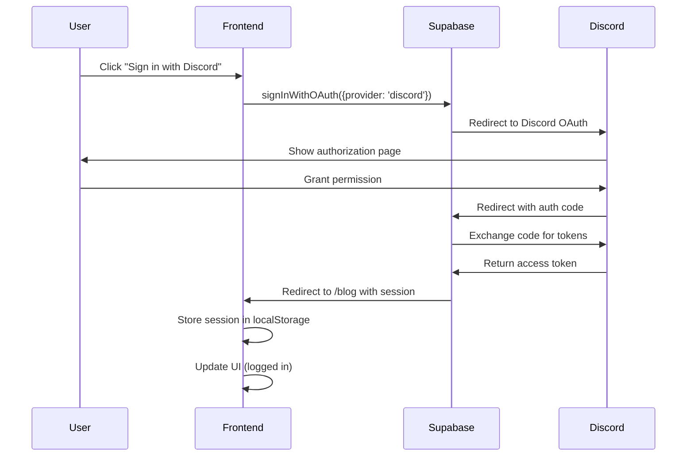

# Migrated to Supabase for Discord OAuth

**Last Updated**: November 11, 2025
**Architecture**: Path-based routing with localhost (simplified)

## Overview

This project mirgated to **Supabase Auth** for Discord OAuth authentication. We do NOT use custom Discord OAuth implementation - Supabase handles everything for us.

---

## Configuration Steps

### 1️**Supabase Dashboard Setup**

#### A. Get Your Project Credentials

1. Go to: https://supabase.com/dashboard/project/YOUR_PROJECT_ID/settings/api
2. Copy these values:
   - **Project URL**: `https://YOUR_PROJECT_ID.supabase.co`
   - **Anon Public Key**: `...` (copy the full key)

#### B. Configure URL Settings

1. Go to: **Authentication → URL Configuration**
2. Set:
   ```
   Site URL: http://localhost:3000
   ```
3. Add these Redirect URLs:
   ```
   http://localhost:3000/**
   http://localhost:3000/blog
   http://localhost:3000/login
   ```

#### C. Enable Discord Provider

1. Go to: **Authentication → Providers**
2. Find **Discord** and click to configure
3. Enable it and note:
   - You'll need Discord Client ID and Secret (get from Discord next)

---

### 2️**Discord Developer Portal Setup**

#### A. Create/Configure Discord App

1. Go to: https://discord.com/developers/applications
2. Select your app or create new one
3. Go to **OAuth2** section

#### B. Set Redirect URI

**IMPORTANT**: Discord redirects to Supabase, NOT your app directly!

Add this redirect URL:

```
https://YOUR_PROJECT_ID.supabase.co/auth/v1/callback
```

#### C. Get Credentials

1. Copy **Client ID**
2. Copy **Client Secret**
3. Go back to Supabase Dashboard

#### D. Add to Supabase

1. In Supabase: **Authentication → Providers → Discord**
2. Paste:
   - **Client ID**: [from Discord]
   - **Client Secret**: [from Discord]
3. Save

---

### 3️**Frontend Environment Configuration**

**File**: `astralnexus_ui/.env.local`

```bash
# Supabase Configuration
VITE_SUPABASE_URL=https://YOUR_PROJECT_ID.supabase.co
VITE_SUPABASE_ANON_KEY=your_anon_key_here

# Application Environment
VITE_API_URL=http://localhost:3001
VITE_APP_URL=http://localhost:3000
VITE_BLOG_URL=http://localhost:3000/blog
VITE_ADMIN_URL=http://localhost:3000/admin
```
---

### 4️**Backend Environment Configuration**

**File**: `astralnexus_be/.env`

```bash
# Application Environment
NODE_ENV=development

# Supabase Configuration
SUPABASE_URL=https://YOUR_PROJECT_ID.supabase.co
SUPABASE_ANON_KEY=your_anon_key_here
SUPABASE_SERVICE_ROLE_KEY=your_service_role_key_here

# Redirect URLs
FRONTEND_SUCCESS_REDIRECT=http://localhost:3000/blog
FRONTEND_ERROR_REDIRECT=http://localhost:3000/login?error=oauth_failed

# CORS Configuration
CORS_ORIGIN=http://localhost:3000
```
---

## Authentication Flow

### User Login Process


